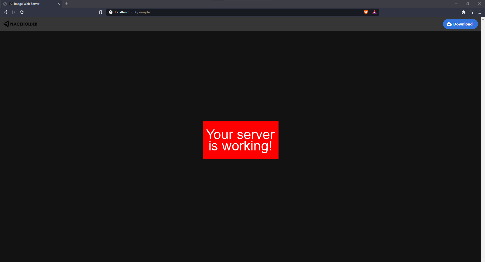

[![Contributors][contributors-shield]][contributors-url]
[![Forks][forks-shield]][forks-url]
[![Stargazers][stars-shield]][stars-url]
[![Issues][issues-shield]][issues-url]
[![MIT License][license-shield]][license-url]

<!-- PROJECT LOGO -->
<br />
<p align="center">
  <h3 align="center">ImageWebServer</h3>

  <p align="center">
    A simple image uploader website for use with screenshot applications such as ShareX.
    <br />
    <br />
    <a href="https://github.com/N0ahMC/ImageWebServer/issues">Report Bug</a>
    ·
    <a href="https://github.com/N0ahMC/ImageWebServer/issues">Request Feature</a>
  </p>
</p>

<!-- ABOUT THE PROJECT -->

## Examples




### Built With

- [Express](https://expressjs.com/)
- [EJS](https://ejs.co/)
- [Bulma](https://bulma.io/)

<!-- GETTING STARTED -->

## Getting Started

To get a local copy up and running follow these simple steps.

### Installation

1. Clone the repo
   ```sh
   git clone https://github.com/N0ahMC/ImageWebServer.git
   ```
2. Install NPM packages
   ```sh
   npm install
   ```
3. Rename `.env.template` to `.env`
4. Configure your `.env` config following directions
5. Start the server
   ```sh
   npm start
   ```
6. ShareX Setup
   1. Edit `ImageWebServer.sxcu` to include the key you set in `.env` and your domain.
   2. Open the file with ShareX and select "Yes" to use it as your image uploader.

<!-- LICENSE -->

## License

Distributed under the MIT License. See `LICENSE` for more information.

<!-- CONTACT -->

## Contact

Noah - N0ahMC#0001 on discord - noah@n0ahmc.com

Project Link: [https://github.com/N0ahMC/ImageWebServer](https://github.com/N0ahMC/ImageWebServer)

<!-- MARKDOWN LINKS & IMAGES -->
<!-- https://www.markdownguide.org/basic-syntax/#reference-style-links -->

[contributors-shield]: https://img.shields.io/github/contributors/N0ahMC/ImageWebServer.svg?style=for-the-badge
[contributors-url]: https://github.com/N0ahMC/ImageWebServer/graphs/contributors
[forks-shield]: https://img.shields.io/github/forks/N0ahMC/ImageWebServer.svg?style=for-the-badge
[forks-url]: https://github.com/N0ahMC/ImageWebServer/network/members
[stars-shield]: https://img.shields.io/github/stars/N0ahMC/ImageWebServer.svg?style=for-the-badge
[stars-url]: https://github.com/N0ahMC/ImageWebServer/stargazers
[issues-shield]: https://img.shields.io/github/issues/N0ahMC/ImageWebServer.svg?style=for-the-badge
[issues-url]: https://github.com/N0ahMC/ImageWebServer/issues
[license-shield]: https://img.shields.io/github/license/N0ahMC/ImageWebServer?style=for-the-badge
[license-url]: https://github.com/N0ahMC/ImageWebServer/blob/main/LICENSE
[product-screenshot]: .github/screenshot.png
